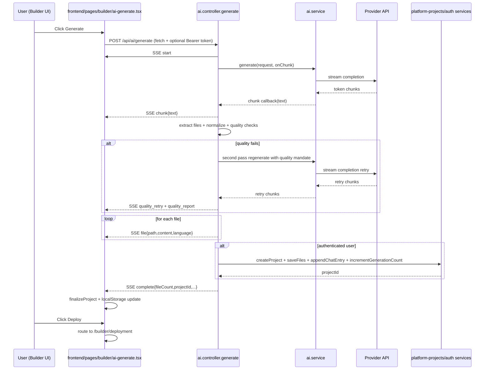

# AI Generation Flow (End-to-End)

This document explains exactly how AI generation works in this project, from the UI action to backend streaming, file extraction, persistence, refine flow, and deployment handoff.

## 1) High-Level Overview

The AI generation pipeline is a streaming workflow:

1. User configures provider/model in Builder step pages.
2. Frontend calls `POST /api/ai/generate` (or `POST /api/ai/refine`) using `fetch`.
3. Backend streams Server-Sent Events (SSE): start/chunk/file/complete/error.
4. Frontend progressively renders text and files in real time.
5. If authenticated, backend persists project + files + chat history and increments usage quota.
6. Frontend stores final generated project in local storage and hands off to deployment.

---

## 2) Main Files Involved

### Frontend
- `frontend/pages/builder/select-ai.tsx`
- `frontend/pages/builder/ai-generate.tsx`
- `frontend/pages/builder/deployment.tsx`
- `frontend/lib/api.ts`
- `frontend/lib/auth.ts`

### Backend
- `backend/src/modules/ai/ai.routes.ts`
- `backend/src/modules/ai/ai.controller.ts`
- `backend/src/modules/ai/ai.service.ts`
- `backend/src/modules/ai/ai.prompts.ts`
- `backend/src/middleware/rateLimit.middleware.ts`
- `backend/src/middleware/generationQuota.middleware.ts`
- `backend/src/modules/platform-projects/platform-projects.service.ts`
- `backend/src/modules/platform-auth/platform-auth.service.ts`

---

## 3) API Routes and Middleware Order

## 3.1 Generate Route
`POST /api/ai/generate` applies middleware in this order:

1. `freeTierLimiter`
2. `generationLimiter`
3. `optionalAuth`
4. `checkGenerationQuota`
5. `aiController.generate`

### Middleware impact

- `freeTierLimiter` (in `ai.routes.ts`)
  - Development: effectively skipped.
  - Production: IP-based daily cap for free usage when no BYOK API key.
  - On limit hit: returns SSE error event payload.

- `generationLimiter` (in `rateLimit.middleware.ts`)
  - Hourly generation cap (global rate limiter for endpoint).

- `optionalAuth`
  - If token exists, user context is attached.

- `checkGenerationQuota` (in `generationQuota.middleware.ts`)
  - If authenticated, checks plan limit in DB via `platformAuthService.checkGenerationLimit`.
  - Blocks with 403 when user quota is exhausted.

## 3.2 Refine Route
`POST /api/ai/refine` applies:

1. `freeTierLimiter`
2. `optionalAuth`
3. `aiController.refine`

Note: `generationLimiter` and `checkGenerationQuota` are not currently in the refine route chain.

---

## 4) Frontend Flow (Generate)

Primary implementation: `frontend/pages/builder/ai-generate.tsx`

## 4.1 Initialization

On page load:

1. If `projectId` is in query params:
   - Calls `GET /api/platform/projects/:projectId`.
   - Hydrates files and chat history into UI.
2. Else:
   - Reads `builderProject` from `localStorage`.
   - Loads provider/model/module/project metadata.

## 4.2 Triggering generation

When user clicks Generate:

1. Frontend appends a `generate` entry to local `chatHistory` state.
2. Calls internal `generate(prompt, false)`.
3. Builds request body:
   - `provider`
   - `apiKey` (optional)
   - `model`
   - `userPrompt`
   - `selectedModules`
   - `projectName`
4. Sends `fetch` request to `${API_BASE_URL}/api/ai/generate`.
5. Adds `Authorization: Bearer <token>` if available.

## 4.3 SSE stream handling in frontend

Client reads stream with `response.body.getReader()` and parses lines prefixed by `data:`.

Frontend reacts to payload content fields (event name is not the primary switch in current client parser):

- `text`: appended to live stream area.
- `path` + `content`: interpreted as one file; pushed into generated file list and rendered immediately.
- `fileCount` or `tokensUsed`: treated as complete metadata event.
- error-like `message`: shown as user error.

If no file events were extracted from the stream, frontend falls back to parsing full streamed text as JSON with a robust extractor.

---

## 5) Backend Flow (Generate)

Primary implementation: `backend/src/modules/ai/ai.controller.ts`

## 5.1 Request validation and provider guard

`aiController.generate` validates:
- required: `provider`, `userPrompt`
- allowed providers: `openai | gemini | anthropic | ollama`

If invalid, returns JSON 400 (non-stream).

## 5.2 SSE channel setup

On valid request, backend sets:
- `Content-Type: text/event-stream`
- `Cache-Control: no-cache`
- `Connection: keep-alive`
- `Access-Control-Allow-Origin: *`

Then begins streaming events.

## 5.3 Provider execution via service

Controller calls `aiService.generate(...)` with a chunk callback.
Every chunk returned by provider is streamed as SSE `chunk` event and accumulated into `fullResponse`.

### Service behavior (`ai.service.ts`)

- Resolves API key:
  - Use user-provided key if present.
  - Else only Gemini can run using platform key (`GEMINI_API_KEY`).
  - Other providers require BYOK.

- Resolves model:
  - Defaults per provider.
  - Gemini can be forced to a safer free-tier model when platform key is used.

- Builds prompt:
  - Uses `buildFullstackPrompt(...)` from `ai.prompts.ts`.
  - Includes system prompt + curated architecture/design instructions.

- Dispatches to provider-specific implementation:
  - OpenAI
  - Gemini
  - Anthropic
  - Ollama

All providers support streaming callbacks for chunk emission.

## 5.4 File extraction and quality guard

After provider stream ends:

1. Backend extracts files with `extractFilesFromResponse(fullResponse)`:
   - First tries full JSON parse.
   - If invalid/truncated JSON, regex/stateful extraction of file objects.
2. Normalizes files using `normalizeGeneratedFiles(...)` to guarantee string `content`.
3. Runs auth UI quality gate (`evaluateAuthUiQuality`) when auth files are present.
4. If quality fails:
   - Emits `quality_retry` event.
   - Regenerates once with strict visual mandate prompt.
   - Compares retry result and may replace extracted files.
   - Emits `quality_report` event.

## 5.5 Streaming files and completion

Backend emits:
- one `file` event per normalized file
- one final `complete` event containing:
  - `projectName`
  - `description`
  - `fileCount`
  - `tokensUsed`
  - `projectId` (if persisted)

If an exception occurs, backend emits `error` event and ends stream.

---

## 6) Persistence Behavior (Authenticated vs Anonymous)

If request is authenticated (`optionalAuth` attached a userId):

1. `platformProjectsService.createProject(...)`
2. `platformProjectsService.saveFiles(projectId, files)`
3. `platformProjectsService.appendChatEntry(projectId, userId, { type: 'generate', prompt })`
4. `platformAuthService.incrementGenerationCount(userId)`

If persistence fails, generation still completes and warning is streamed; app remains usable in-session via local storage fallback.

If not authenticated:
- No DB project write.
- Frontend still receives files and can continue flow.
- Deployment APIs that require `projectId` will be blocked, but local ZIP fallback works.

---

## 7) Refine Flow

Frontend calls `POST /api/ai/refine` with:
- `provider`
- `apiKey` (optional)
- `model`
- `previousCode` (currently streamed text buffer)
- `refinementRequest`
- `projectId` (if known)

Backend `aiController.refine`:

1. Streams start/chunk/file/complete similar to generate.
2. Extracts and normalizes files.
3. If authenticated and `projectId` exists:
   - overwrites project files via `saveFiles`
   - appends refine chat entry via `appendChatEntry`
4. Emits complete metadata with file count and projectId.

Frontend updates file tree and appends refine history entry in UI/local state.

---

## 8) SSE Event Contract (Current Practical Contract)

The backend emits named SSE events, but frontend currently parses payload content keys rather than switching strictly on event type.

Common payload shapes:

```json
{ "message": "Generation started", "provider": "gemini" }
```

```json
{ "text": "<streamed chunk text>" }
```

```json
{ "path": "frontend/pages/login.tsx", "content": "...", "language": "tsx" }
```

```json
{
  "projectName": "authentication",
  "description": "...",
  "fileCount": 24,
  "tokensUsed": 12345,
  "projectId": "..."
}
```

```json
{ "message": "<error message>" }
```

---

## 9) Local Storage Handoff and Deployment

After generation/refine, frontend stores/updates `builderProject` in `localStorage` with:
- `generatedCode`
- `projectId`
- `chatHistory`
- `buildPath`

Then deploy step consumes this state.

Deployment behavior:
- If `projectId` exists: server-side deploy APIs available.
- If no `projectId`: deploy APIs blocked, but ZIP download is built from local generated files using JSZip fallback.

---

## 10) Failure Modes and Safeguards

1. Provider/API failures
- Backend wraps and streams errors; frontend shows alert.

2. Truncated/invalid JSON from LLM
- Backend extraction fallback parser recovers file objects when possible.
- Frontend has final JSON parsing fallback too.

3. Non-string file contents
- Normalization converts object/unknown content to strings before DB save to prevent cast errors.

4. Quota/rate-limit issues
- IP-based free tier cap for anonymous/non-BYOK use.
- Endpoint generation limiter.
- Plan-based user quota check for authenticated generation.

5. Persistence failures
- Warning event streamed; generation output still delivered so user does not lose result.

---

## 11) Sequence Diagram



---

## 12) Practical Notes for Future Work

1. Frontend SSE parser can be improved by switching on SSE event names (`event:`) instead of only payload keys.
2. Refine currently sends `previousCode` from streamed text; sending structured previous files may produce stronger refinements.
3. Provider metadata in `/api/ai/providers` should stay synchronized with frontend provider model list to avoid drift.
4. Current retry quality guard is auth-focused; similar guards can be added for other modules.

---

## 13) Quick Trace Checklist (for debugging)

1. Open browser Network tab and confirm `POST /api/ai/generate` returns `text/event-stream`.
2. Verify SSE includes `chunk`, then `file`, then `complete` payloads.
3. Confirm frontend file tree updates while stream is active.
4. Check DB for project row + fileCount + chatHistory when authenticated.
5. Confirm `generationsUsed` increments after successful authenticated generation.
6. Confirm deployment page receives `projectId` from local storage.
